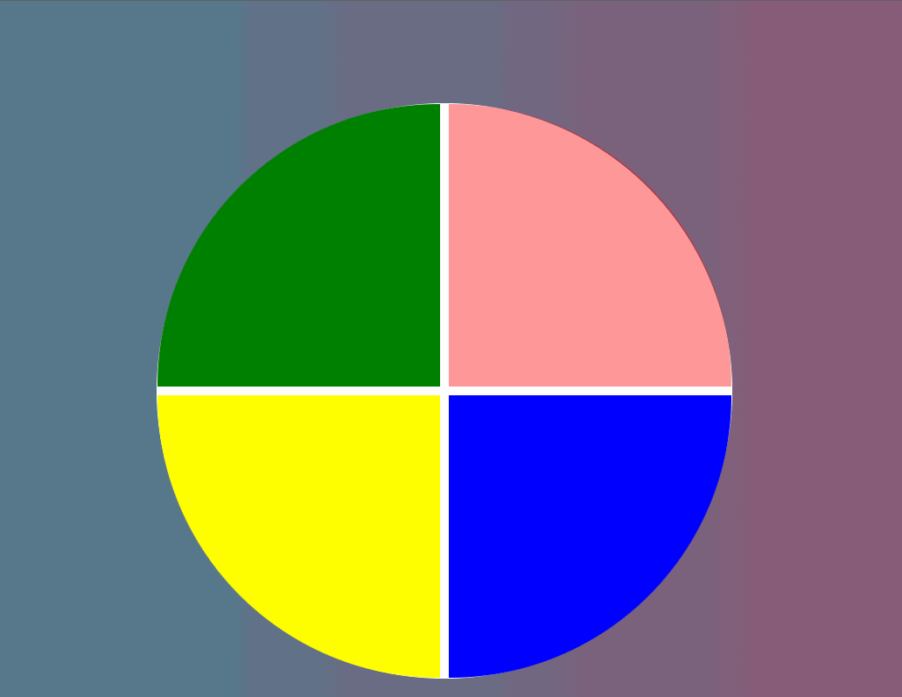

 <h1 align="center">Genius</h1>

</img>

 
Nesse projeto, o desafio foi criar um jogo Gênesis utilizando apenas <strong>HTML, CSS e Javascript</strong> de forma introdutória, sendo o principal conceito, CSS Grid, manipulação de Array e Arrow Functions.

 <h3>Créditos :</h3>

- Professora Gabriela Pinheiro [Youtube](https://www.youtube.com/c/GabrielaPinheiro)

- Site do Curso: [Digital Inovation One](https://web.digitalinnovation.one/home)

---

### **Desenvolvido por:**

|        [Erick F.](https://github.com/Nic-Developer)         |
| :---------------------------------------------------------: |
|  |
